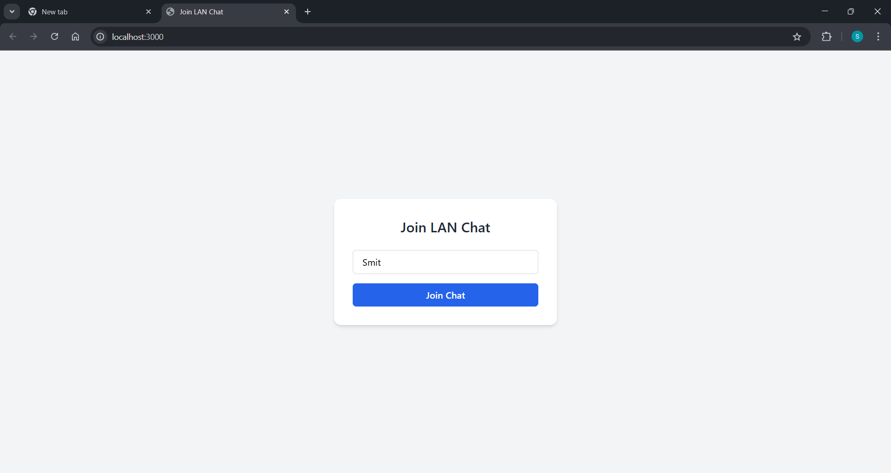
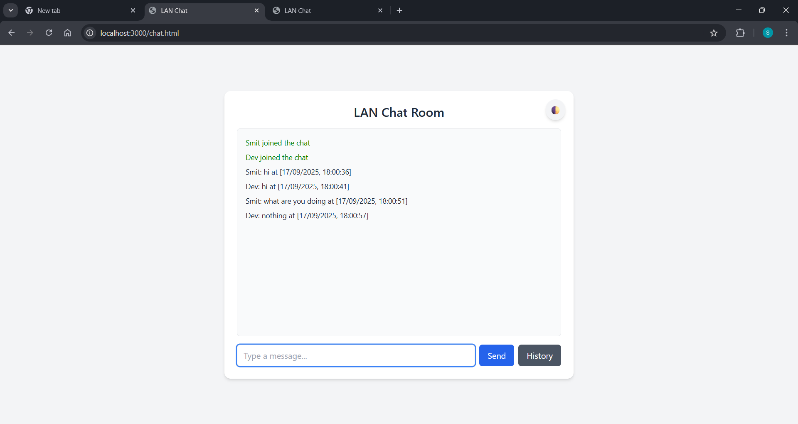

# LAN Chat Application

A simple LAN-based chat application built using **Node.js** and **Socket.IO**.  
This app allows multiple users on the same network to join a chat room and communicate in real-time.

---

## Features
- Real-time communication using WebSockets (Socket.IO).
- Simple and clean UI.
- Users can join with a username.
- Runs on local network (LAN).

---

## Screenshots

### Join Page


### Chat Room


---

## Installation

1. Clone the repository:
   ```bash
   git clone <your-repo-url>
   cd lan-chat-app
